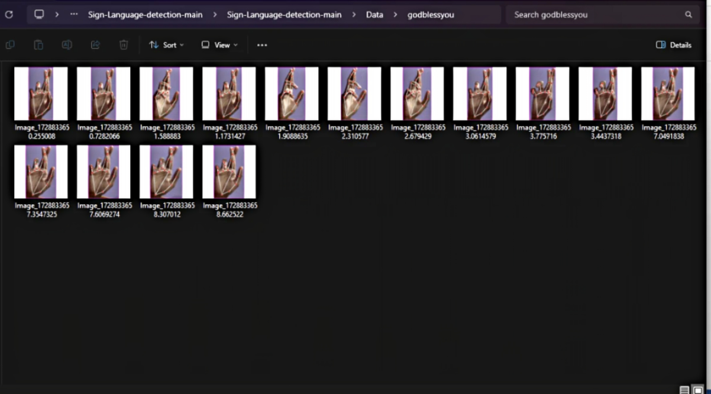
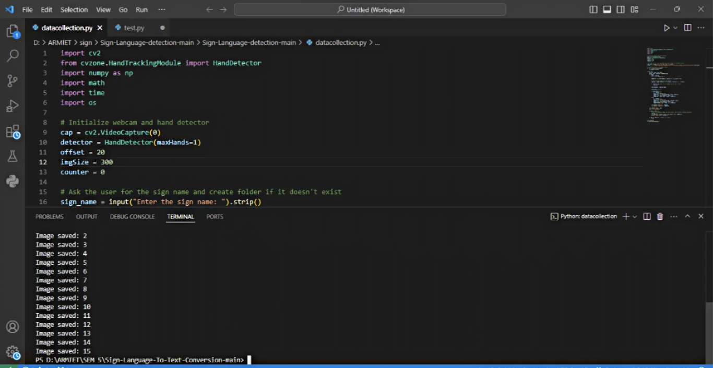
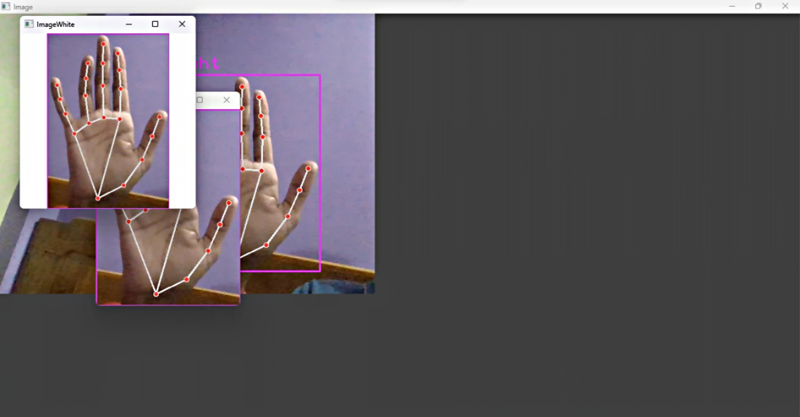
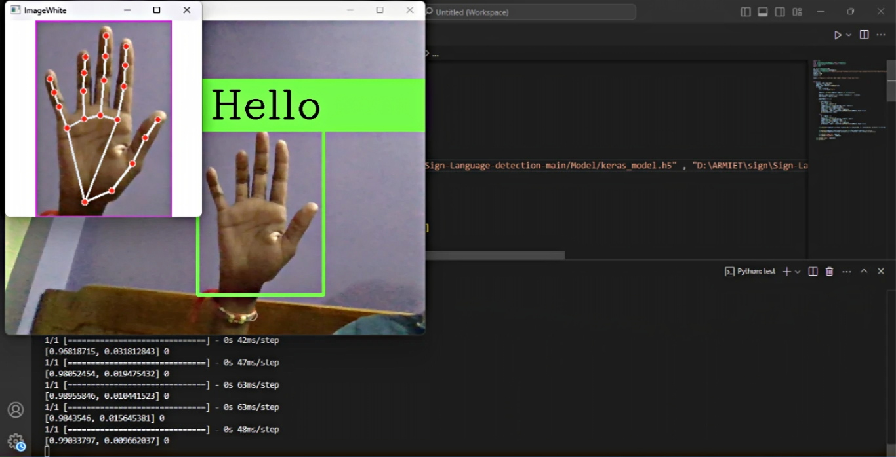

# 🤟 Sign Language Detection using OpenCV and AI

## 🚀 Quick Summary

This project detects and recognizes **sign language gestures in real-time** using computer vision and machine learning.

👉 **Goal:** Bridge the communication gap between deaf/mute individuals and others
👉 **Outcome:** Real-time gesture recognition using webcam

---

## 📌 Objective

* Detect hand gestures using camera
* Recognize sign language symbols
* Convert gestures into readable output
* Enable real-time interaction

---

## 📂 Dataset

* Custom dataset created using webcam
* Images stored in folders representing each sign
* Used for training machine learning model

👉 Sign language systems typically rely on image datasets + ML models for gesture classification ([Arshad Kazi][1])

---

## ⚙️ Approach

### 1. Data Collection

* Captured hand gesture images using OpenCV
* Stored images class-wise (A, B, C… or words)

### 2. Data Preprocessing

* Resized images
* Converted to grayscale
* Normalized pixel values

### 3. Model Training

* Trained ML model on collected dataset
* Learned patterns of hand gestures

### 4. Real-Time Detection

* Used webcam input
* Detected hand region
* Predicted sign instantly

👉 Similar systems use computer vision + ML for real-time gesture recognition ([GitHub][2])

---

## 📊 Project Demonstration

### 🗂️ Dataset Samples



👉 Custom dataset collected using webcam for different sign gestures.

---

### 💻 Data Collection Process



👉 Script used to capture and store gesture images for training.

---

### 🤖 Real-Time Detection



👉 Hand tracking with keypoints and live gesture recognition.

---

### 🧠 Prediction Output



👉 Model predicts the detected sign (example: "Hello") in real-time.

---


## 🖥️ System Workflow

1. Capture hand gesture via webcam
2. Extract region of interest (ROI)
3. Process image
4. Predict using trained model
5. Display detected sign

---

## 📊 Features

* 📷 Real-time gesture detection
* 🤖 AI-based classification
* ⚡ Fast prediction
* 🧠 Custom training capability
* 🖥️ Simple interface

---

## 🔍 Key Insights

* Gesture recognition depends heavily on clean data
* Consistent background improves accuracy
* More training data = better predictions
* Real-time detection requires optimized processing

---

## 🛠️ How to Run

```bash
pip install opencv-python numpy tensorflow keras
python app.py
```

---

## 📌 Conclusion

* AI + Computer Vision can enable real-time sign language detection
* Helps improve communication accessibility
* Can be extended into real-world assistive tools

👉 This project demonstrates how technology can solve real human problems

---

## 🚀 Future Improvements

* Convert to full sentence detection
* Add voice output
* Deploy as web app (Flask/Streamlit)
* Improve accuracy with deep learning

---

## 📌 Note

Performance depends on:

* lighting conditions
* background noise
* quality of training data

---
